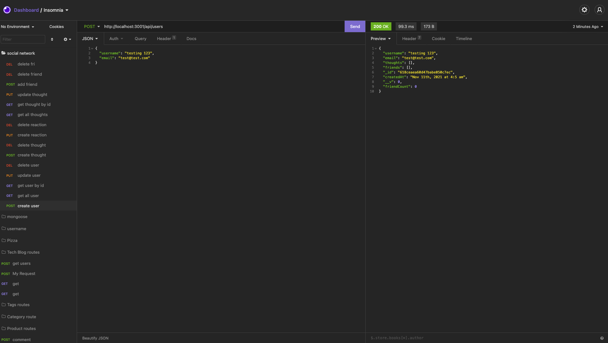

# social-network

## Description

AS A social media startup

I WANT an API for my social network that uses a NoSQL database

SO THAT my website can handle large amounts of unstructured data

## Table of content
* [link to walkthrough video](#video)
* [Description](#description)
* [Project Requirements](#projectrequirements)
* [Installation](#installation)
* [Usage](#usage)
* [Credits](#credits)
* [License](#license)
* [Badges](#Badges)
* [Contributing](#contributing)

## Link to walkthrough video

[link to a walk-through video of how the app works](https://youtu.be/S-xDNt8uHD0)

## Project Requirements

* WHEN I enter the command to invoke the application
    
`THEN my server is started and the Mongoose models are synced to the MongoDB database`

* WHEN I open API GET routes in Insomnia Core for users and thoughts

`THEN the data for each of these routes is displayed in a formatted JSON`

* WHEN I test API POST, PUT, and DELETE routes in Insomnia Core

`THEN I am able to successfully create, update, and delete users and thoughts in my database`

* WHEN I test API POST and DELETE routes in Insomnia Core

`THEN I am able to successfully create and delete reactions to thoughts and add and remove friends to a user’s friend list`

## Installation

Run these commands to Install individual packages to use the app

* `npm init -y` (node.js package)

* `npm install express` (express.js package)

* `npm install mongoose` (mongoose package)

OR run `npm install` to install all packages at once

## Usage 

* At the root of the project , run `npm start` to start the server and link to database.
* Navigate to insomnia core to perform `CRUD` on the `User` and `Thought Models`.
* Create and Delete `Reactions` for the Thoughts and get the total counts of reactions a thought has.
* Add `Friends` to the User and get the total counts of friends.

## Credit
This app was made with love and hardwork by Praise Opara

## License

[MIT](https://opensource.org/licenses/MIT)

## Badges

## Contributing

